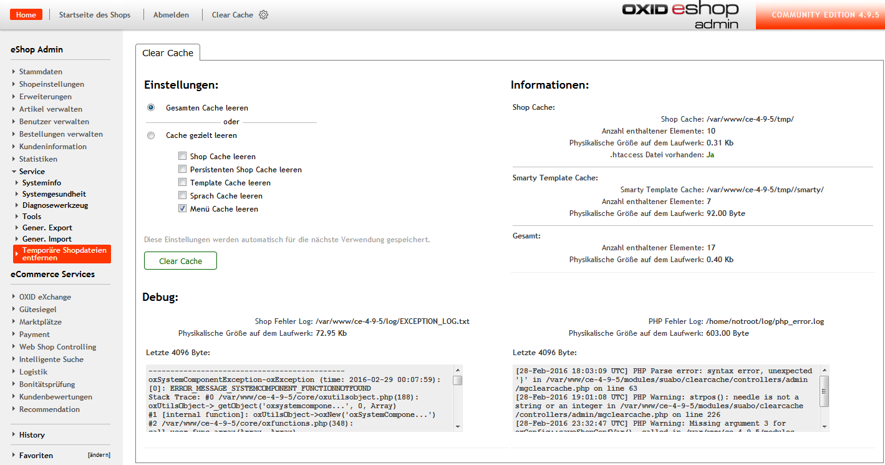

Clear Cache
===============

Mit dem Clear Cache Modul können Sie Cache und Debug Informationen aus dem Backend einsehen und den Cache leeren.
Außrdem wird geprüft ob eine .htaccess Datei im Cache Verzeichnis vorhanden ist und erstellt, falls benötigt.

Sehen sie außerdem die letzten 4096 Byte der OXID & PHP Fehler Log in der Übersicht von Clear Cache.
So kommen Sie Fehlern in Zukunft schneller auf die Spur.

## Installation ## 

Deutsch:
1. copy_this in Shop Root Verzeichnis kopieren
2. Modul im Backend aktivieren
3. Tmp/Chache letztes mal von Hand leeren

English:
1. copy_this into shop root folder
2. activate module in oxid backend
3. clear tmp/ last time manually

## Clear Cache Button in Admin Headbar (optional) ##

Deutsch:
Sie können mit einer einfachen Anpassung an einem Admin Template den Button über 
ein bereits begefügtes Block Template in die Obere Frame im Admin einfügen.
Fügen Sie hierzu den Block `header_buttons` im Admin Template `application/views/admin/tpl/header.tpl` ein:

English:
Setup a Button in the upper frame of the backend by inserting the smarty block `header_buttons` 
into the admin template `application/views/admin/tpl/header.tpl`:

    <ul>
    [{block name="header_buttons"}]
    ...
    <li>...</li>
    ..
    [{/block}]
    </ul>
